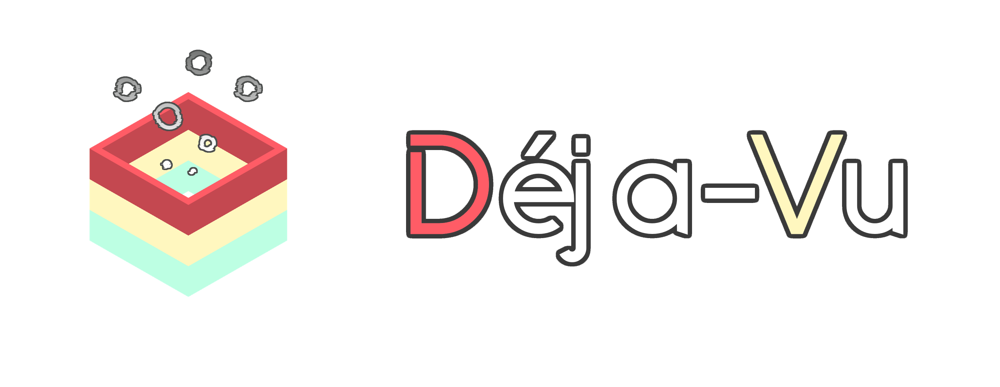

<i>Connect your universe to another</i>

This is a (Fabric) Minecraft mod that adds various items and blocks inspired from other games/universes/jokes/ecosystems etc...

*Note : the mod needs Patchouli in order to have the **Common Memories** (mod's in-game documentation) book.*

> Themed dimensions inspired by the mod's universes may be implemented in the future. Just keep an eye on the **Dejavu Table**, would you ?